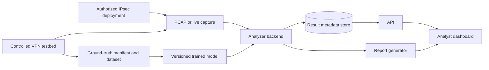
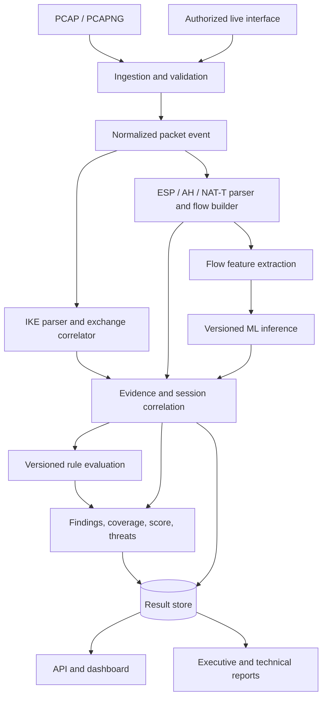

# SIH26160 IPsec Analyzer — System Architecture

**Status:** target design with current implementation called out explicitly.  
**Scope:** controlled VPN generation through analyst reports and SIH deliverables.

## 1. Mission and requirements

The system observes an IPsec deployment using a packet capture or live stream, parses visible protocol data, estimates selected hidden properties with uncertainty, evaluates security posture, and explains results to analysts. The [published SIH26160 listing](https://sih2026.vuce.in/ps/SIH26160) asks for a configurable VPN testbed, IKE/ESP captures (AH optional), protocol identification, encrypted traffic classification, security assessment, scores, reports, dashboard, dataset, documentation, prototype and demo video. That listing is an unofficial archive; an official statement takes precedence. The Word document in this repository is research input, not proof of its proposed accuracy or throughput.

| Requirement | Owner | Output |
| --- | --- | --- |
| Tunnel/transport, algorithms, DH, PFS, IPv4/IPv6, traffic classes | Testbed | Run manifest, ground truth, capture |
| PCAP/PCAPNG and live input | Ingestion | Normalized packet events |
| IKE version, proposals, selection, SA properties | IKE parser/correlator | Exchange records and evidence |
| ESP/AH, NAT-T, SPI, sequence, timing | Data-plane parser/flow builder | Flows and statistics |
| Operating mode and application class | Evidence resolver/ML | Inference with confidence or unknown |
| Crypto, compliance, lifetime, replay, PFS, exposure | Rules/assessment | Findings and coverage |
| Security/risk score and threat matrix | Assessment | Versioned, explainable result |
| Investigation and report export | API, dashboard, reporting | UI, JSON/PDF/HTML reports |

## 2. Architecture principles

1. Parse visible facts before applying ML. A model never overwrites an observed field.
2. Preserve provenance: every result identifies its packet/exchange/flow, method and rule or model version.
3. Separate a proposed IKE transform from a selected transform and from an installed SA.
4. Use `UNKNOWN` when evidence is absent; do not convert missing data into a safe default.
5. Separate standards requirements, project rules and scoring policy.
6. Keep deterministic analysis useful when the classifier is unavailable.
7. Make claims only after reproducible verification. No decryption, accuracy or line-rate claim is implied by this design.

## 3. System context and trust boundaries



Captures, testbed keys and labels are sensitive. Ground truth is used to evaluate blind analysis, never supplied to the analyzer as if it were packet evidence. The small shared Phase 4 PCAPs contain only filtered traffic from controlled documentation addresses; generated PSKs and daemon logs stay in ignored run directories. Each shared record pins its capture hash, run group, scenario label and, for generated traffic, deterministic seed. `data/dataset-index.json` validates those records and assigns whole runs to pilot partitions; it is not an ML performance claim. The dashboard receives structured results rather than raw secrets or packet payloads. Live capture requires authorization and appropriate host permissions.

## 4. Deployment and processing model

The current prototype is a modular Python backend with a HTML/CSS/JavaScript analyst dashboard with a self-hosted Motion DOM bundle. A bounded analysis job processes each offline capture. The local API keeps at most 16 results in memory and deletes uploaded capture bytes after analysis. A separate Linux/WSL command captures one bounded window on a named interface with tcpdump, analyzes its temporary PCAP through the offline pipeline, and deletes the raw window on return. The live command has simulated-process parity checks; a real-interface run is pending. SQLite or another persistent store should be introduced only when multi-user or durable job requirements are defined. A React/TypeScript migration, worker service, broker, time-series database or specialized capture daemon is added only if demonstrated need justifies it.

Current offline results record the capture identity and hash, packet count, analysis version, rule-set version, parsed sessions, flows, evidence, evaluations, failed-rule findings, scoring-policy version and limitations. The Phase 4 lab generator records scenario configuration and hashes; a separate registrar records capture identity after checking visible IKE selection and ESP. Neither record attests that a daemon loaded the configuration. The local API analyzes an upload synchronously and stores up to 16 results in memory; it does not expose durable jobs or job states. Recording full runtime provenance and persistent jobs remains future work; live input currently runs as a separate local command, not an API job.

## 5. End-to-end pipeline



### 5.1 Ingestion

Validate file format, length and resource limits. Decode link/network layers and retain timestamp, packet index, source/destination, IP version, protocol, ports, length and relevant raw slices. Dispatch UDP/500, UDP/4500, native ESP (IP protocol 50) and AH (51). For UDP/4500, distinguish IKE's non-ESP marker, encapsulated ESP and NAT keepalive. Truncated and malformed packets produce diagnostics with packet references; unrelated traffic is not represented as decrypted tunnel content.

### 5.2 IKE control plane

Parse validated IKEv1/IKEv2 headers and visible payload chains, proposals and transforms. Correlate requests, responses and retransmissions using endpoints, initiator/responder SPIs or cookies, exchange type, message ID and time. Maintain separate states for offered, selected and installed values. A request alone is not proof of the negotiated cipher. Encrypted IKE payloads and absent exchanges may hide identities, Child SA parameters, lifetime and PFS; those fields remain unknown unless other trusted evidence exists.

The current parser keeps IKEv1 transform attributes in a separate `v1_proposals` field from IKEv2 `proposals`. It decodes only IPsec DOI 1 with identity-only situation 1 and reports unsupported variants. It never interprets an IKEv1 proposal as an IKEv2 selected transform.
Variable-length IKEv1 attributes expose small numeric values only for recognized numeric classes; opaque bytes are omitted from API results. Transform and attribute counts are bounded.

### 5.3 ESP/AH data plane

Decode visible outer headers, SPI and sequence data for native ESP, UDP-encapsulated ESP and AH. Build directional flows by endpoints, encapsulation, SPI and time; pair directions and link IKE exchanges only when evidence supports the relationship. Compute counts, byte totals, packet-size distribution, inter-arrival times, bursts, ratios and sequence observations. A sequence gap does not by itself prove packet loss or disabled anti-replay.

Packet event schema 1.1 records `encapsulation` as `NATIVE_IP` or `UDP_4500` for decoded ESP, and `NATIVE_IP` for AH. Flow grouping preserves this value so identical SPIs in different encapsulations do not merge.

### 5.4 Session and evidence layer

A session groups exchanges, SAs, flows, observations, inferences and parse diagnostics. Correlation records its method and ambiguity. Concurrent tunnels and reused SPIs must not be merged merely because endpoints match. The output describes observed evidence, not a complete hidden gateway configuration.

The current offline correlation contract is documented in [CORRELATION_AND_EVIDENCE.md](docs/design/CORRELATION_AND_EVIDENCE.md). The analyzer returns packet-linked evidence records, partial exchange states, and explicit uncertainty when responder SPIs, response proposals or long idle periods prevent a confident association.

The Phase 5 synthetic pilot loads a bounded JSON centroid artifact from `models/artifacts/traffic-classifier/`. It produces separate per-flow `INFERRED` estimates or `UNKNOWN`/`unknown/other` abstentions in `ai_inference.flows`. Missing or incompatible artifacts leave deterministic rule evaluations available. The six-run test partition is one-host synthetic evidence only; its confidence values are not validated for real application identity.

### 5.5 Feature and AI layer

The first classifier predicts application traffic within ESP using packet length, timing, direction and burst features. It always outputs `INFERRED`, a class distribution, calibrated confidence or abstention, evidence references, model version and feature-schema version. A separate operating-mode classifier may be added after validation. Outer ESP alone does not establish tunnel versus transport mode. Cipher family, PFS and anti-replay configuration must not be asserted from ESP sizes.

Candidate structured models such as XGBoost are evaluated before sequence models. Dataset splits must be by run/tunnel/scenario, not adjacent packets from the same session. Measure per-class behavior, calibration and performance on unseen configurations/generators. An unavailable, incompatible or uncertain model returns unknown and leaves deterministic analysis intact.

### 5.6 Rules, findings, score and threat matrix

Each rule declares ID/revision, exact baseline reference, applicability, required evidence, condition, severity rationale and remediation. Evaluations return `PASS`, `FAIL`, `UNKNOWN` or `NOT_APPLICABLE`. Findings link the rule to packet/exchange/flow evidence, observed values, impact and limitations. No finding is not proof of compliance. Standards clauses must be checked against authoritative text before activating a standards-based rule.

Assess cryptographic choices, SA properties, lifetime/rekey, replay, PFS, cipher-suite composition and metadata exposure only to the extent supported by evidence. Inferred application class informs traffic analysis, not deterministic crypto compliance. Threat mappings describe plausible impacts and use MITRE techniques only when justified; they do not assert an attack occurred.

The versioned score policy defines weights, penalties, normalization and handling of unknown dimensions. Every score exposes formula/version, contributing findings and evidence coverage. Low coverage yields a provisional or withheld overall score. AI confidence is about a model prediction, not the probability that the whole assessment is correct.

### 5.7 API, dashboard and reporting

The current API returns synchronous analysis results containing sessions, exchanges, flows, evidence, three versioned rule evaluations per session, failed-rule findings, coverage, a narrow assessed-rule pass rate and explicit unknown fields. The overall security/risk scores remain withheld. Focused resources expose sessions, flows, findings and evidence; status is `complete` while a result remains in memory, then unavailable after eviction or restart. The analysis result also includes at most 5,000 metadata-only summaries for packets cited by rule evaluations or selected IKE responses, with an explicit truncation flag; frame bytes and payloads are excluded. The dashboard shows rule and exchange detail, packet references, a separate `INFERRED` traffic table, limitations and report actions. One versioned report document feeds text, HTML, a bounded text-only PDF and JSON. Shared copies in all formats omit capture identifiers, endpoint addresses and SPI values. Durable jobs, persistent storage and deployment authentication remain future capabilities.

## 6. Canonical contracts

The current packet event schema is version 1.1. A capture ID is derived from its SHA-256 hash; sessions and flows receive deterministic IDs within that capture. Packet references use the capture ID and one-based packet indices. Timestamps are converted to nanoseconds; subnanosecond precision is truncated with a diagnostic. Results are not durably persisted; redacted report exports exist in text, HTML, PDF and JSON.

The following contracts describe the target model. Current results implement only the fields documented in [Phase status](docs/design/IMPLEMENTATION_STATUS.md) and [Offline correlation and evidence contract](docs/design/CORRELATION_AND_EVIDENCE.md).

```text
Capture {id, source_type, hash_or_stream_id, time_range, packet_count,
         parser_version, diagnostics}
PacketEvent {capture_id, index, timestamp, endpoints, protocol, length,
             decoded_fields, diagnostics}
Exchange {id, ike_version, endpoints, spis, exchange_type, message_ids,
          offered_proposals, selected_proposal?, packet_refs, completeness}
Flow {id, endpoints, encapsulation, spi, direction, time_range,
      packet_refs, statistics, sequence_observations}
Evidence {id, subject_id, field, value?, state, source_refs,
          method_version?, confidence?, reason?}
Inference {id, target, prediction?, probabilities?, confidence?,
           abstained, model_version, feature_schema_version, evidence_refs}
Finding {id, rule_id, rule_version, status, severity?, subject_id,
         evidence_refs, rationale, impact, remediation, baseline_ref?}
Assessment {id, capture_id, session_ids, findings, coverage,
            score?, score_policy_version, rule_set_version, limitations}
```

Evidence states are `OBSERVED` (directly decoded), `DERIVED` (calculated), `INFERRED` (estimated) and `UNKNOWN` (unavailable). Rule status is separate. Unknown fields have null values and explicit reasons, not default zero or false.

## 7. What the analyzer can conclude

| Question | Direct evidence | Missing evidence behavior |
| --- | --- | --- |
| IPsec/IKE/ESP/AH present? | Protocol and encapsulation markers | Unknown for ambiguous packets |
| IKE version and offered proposals? | Visible IKE headers/payloads | Unknown if absent/encrypted |
| Selected cipher, DH or authentication? | Selected response or validated exchange | Keep offer; selection unknown |
| Tunnel or transport? | Trusted topology/configuration or separately validated inference | Unknown if unsupported |
| Child SA lifetime, PFS, replay setting? | Decodable exchange or trusted configuration | Unknown; ESP behavior is not configuration proof |
| Application carried inside ESP? | No direct passive visibility | Inferred model estimate or abstention |
| Compliance? | Applicable rule with sufficient evidence | Unknown or not applicable |

## 8. Testbed and dataset

An isolated lab uses Linux namespaces or VMs, virtual links and strongSwan/Libreswan to vary tunnel/transport mode; IKE version; AES-128/256, GCM or CBC plus HMAC; DH groups; PFS; IPv4/IPv6; native ESP/NAT-T and optional AH; lifetime, replay and ESN where controllable. A run manifest records topology, software/configuration versions, generator, capture points and seed. Keys are generated for the run and excluded from committed artifacts.

Traffic generators cover VoIP-like, messaging-like, email, web, ICMP and video patterns. Synthetic traffic is labeled as synthetic, not as a real commercial app. Capture IKE and ESP plus normal communication where relevant. Each scenario yields ground-truth labels, manifest, capture checksum and reproducibility instructions. Dataset documentation records source, generator, capture conditions, labels, preprocessing, splits, versions and privacy constraints. Training/validation/test partitions are separated by run/tunnel to reduce leakage.

The current Phase 4 pilot has two Linux namespaces, isolated strongSwan peers, five configuration scenarios, six synthetic traffic profiles and two Child SA rekey checks on Ubuntu WSL2. Forty-four small outer-link PCAPs and sidecar labels are pinned in `data/sample/`, including thirty varied repeat runs and IPv6 and UDP encapsulation references. Rekey sidecars come from `swanctl --list-sas`; the passive analyzer still reports PFS as unknown. The pilot comes from one host and is not suitable for model performance claims.

## 9. Interfaces, persistence and security

Current local API resources are `POST /api/analyses` (raw capture bytes), `GET /api/analyses/{id}`, focused `/status`, `/sessions`, `/flows`, `/findings`, `/evidence` and `/evidence/{evidence_id}` resources, and `/report?format=text|html|pdf|json`. The report endpoint accepts `redacted=true` in every format. The dashboard is served at `/`. Persistent storage and live start/stop/status remain target interfaces. Validate uploads, paths, formats and query bounds. Current upload limit is 16 MiB, results are bounded in memory and raw uploads are deleted after processing. Bind the prototype to loopback only; it has no user authentication and is not a network service.

Treat PCAP as untrusted input: validate lengths and nesting, cap CPU/memory/time, and isolate parse failures by packet/job. Avoid payloads and secrets in routine logs and API results. Separate testbed orchestration privileges from analysis privileges. Restrict raw capture and report access and support redaction for sharing. Deployment-specific authentication and authorization are finalized once the hosting environment is selected.

## 10. Verification gates

| Layer | Essential checks |
| --- | --- |
| Parsing | Valid/malformed PCAP and PCAPNG; IPv4/IPv6; IKEv1/v2; ESP/NAT-T; optional AH |
| Correlation | Retransmissions, partial exchanges, concurrent SAs, SPI reuse and ambiguity |
| Evidence | Provenance, unknown state and proposal-versus-selection distinction |
| Rules/score | Fail, pass, unknown, boundary and version/coverage cases |
| ML | Run-level holdout, per-class metrics, calibration, abstention and schema compatibility |
| API/UI/reports | Valid, empty, partial and error states; export consistency and redaction |
| Live | Permissions, stop/restart, dropped packets and bounded resources before support is claimed |
| End to end | Recreate a testbed scenario and trace a report finding to packet and rule |

Performance claims require measurement on named hardware, captures and settings.

## 11. Implementation sequence and deliverables

1. Foundation: package, contracts, offline ingestion, diagnostics and fixtures.
2. Protocol core: IKE, ESP/NAT-T, optional AH, exchange/flow correlation and provenance.
3. Assessment: reviewed rules, coverage-aware score, JSON/technical report.
4. Testbed: configuration matrix, ground truth, captures and dataset card.
5. AI: versioned features, trained/evaluated classifier, calibration and abstention.
6. Product: API, interactive dashboard, executive/PDF report.
7. Live path: authorized adapter, limits, security controls and measured performance.
8. Submission: working prototype, classifier, dashboard, assessment report, demo video, technical documentation and dataset.

This is an implementation order, not permission to omit required deliverables. A capability is complete only when it runs, exposes limitations and can be reproduced.

## 12. Repository ownership and open decisions

Production Python code belongs under `src/ipsec_analyzer/`: `ingestion`, `parsers`, `models` (domain schemas), `features`, `rules`, `assessment`, `ml`, `reporting`, `api` and `common`. Frontend belongs in `dashboard/web/`; testbed in `testbed/`; tests in `tests/`; dataset in `data/`; trained artifacts and metadata in top-level `models/`; design and standards notes in `docs/`. `DIRECTORY_CONSTRAINTS.md` defines exact file rules.

Decisions requiring evaluation: decoder coverage and malformed-input safety; precise standards clauses and baseline profiles; passive mode-inference validity; model generalization beyond lab traffic; and whether live load warrants a worker queue or faster capture path. Until validated, the contracts above report unknown, partial support or model abstention.
