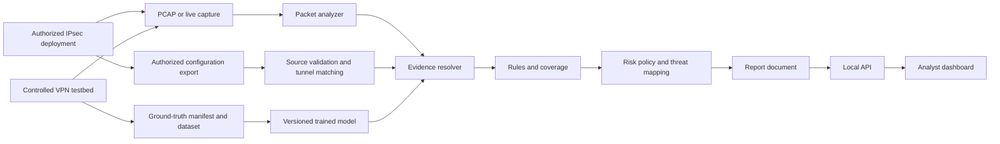
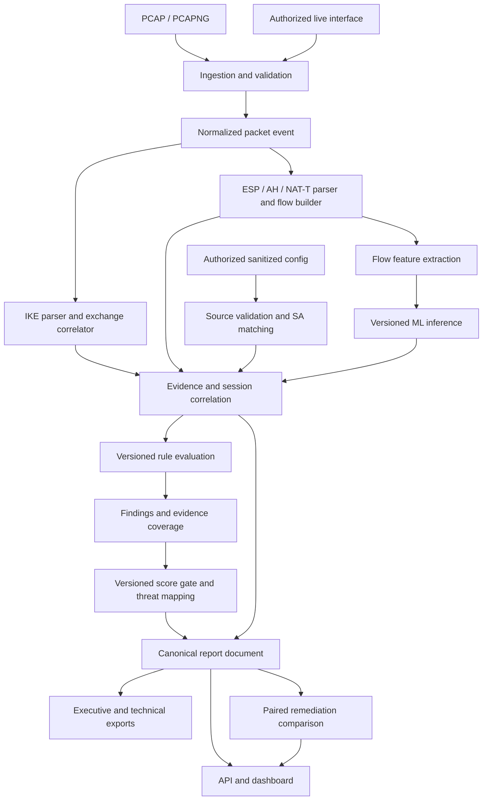

# SIH26160 IPsec Analyzer — System Architecture

**Status:** target design with current implementation called out explicitly.  
**Scope:** controlled VPN generation through analyst reports and SIH deliverables.

## 1. Mission and requirements

The system observes an IPsec deployment using a packet capture or live stream,
parses visible protocol data, estimates encrypted traffic type with uncertainty,
evaluates security posture, and explains results to analysts. The user-supplied
SIH 2026 problem statement (ID 26160, "AI-Powered IPsec VPN Protocol Analyzer
and Security Assessment Framework") asks for a configurable VPN testbed,
IKE/ESP captures (AH optional), protocol identification, encrypted traffic
classification, security assessment, a security/risk score and threat matrix,
reports, dashboard, dataset, documentation, prototype and demo video. The Word
document in this repository is research input, not proof of its proposed
accuracy or throughput. The [SIH-aligned implementation gates](docs/design/IMPLEMENTATION_PHASES.md)
define the acceptance work; [phase status](docs/design/IMPLEMENTATION_STATUS.md)
records what actually runs.

| Requirement | Owner | Output |
| --- | --- | --- |
| Tunnel/transport, algorithms, DH, PFS, IPv4/IPv6, traffic classes | Testbed | Run manifest, ground truth, capture |
| PCAP/PCAPNG and live input | Ingestion | Normalized packet events |
| IKE version, proposals, selection, SA properties | IKE parser/correlator | Exchange records and evidence |
| ESP/AH, NAT-T, SPI, sequence, timing | Data-plane parser/flow builder | Flows and statistics |
| Operating mode and hidden SA settings | Authorized configuration evidence resolver | Matched configuration fact or unknown; never infer from ESP alone |
| Application traffic class inside ESP | ML | Synthetic-profile inference with confidence or abstention |
| Crypto, compliance, lifetime, replay, PFS, exposure | Rules/assessment | Evidence-linked findings and coverage |
| Security/risk score and threat matrix | Assessment | Versioned, gated score and evidence-linked threat rows |
| Investigation and report export | API, dashboard, reporting | UI, JSON/PDF/HTML reports |

## 2. Architecture principles

1. Parse visible facts before applying ML. A model never overwrites an observed field.
2. Preserve provenance: every result identifies its packet/exchange/flow or
   matched authorized configuration source, method and rule or model version.
3. Separate a proposed IKE transform from a selected transform and from an installed SA.
4. Use `UNKNOWN` when evidence is absent; do not convert missing data into a safe default.
5. Separate standards requirements, project rules and scoring policy.
6. Keep deterministic analysis useful when the classifier is unavailable.
7. Make claims only after reproducible verification. No decryption, accuracy or line-rate claim is implied by this design.
8. Keep testbed ground truth out of blind packet analysis. Configuration-aware
   assessment is an explicitly selected mode with a separate trust label.
9. Treat risk score, evidence coverage and model confidence as distinct values.
10. Verify remediation from comparable before/after evidence; missing packets
    alone do not prove that a vulnerable configuration was removed. Evidence
    tiers and remediation workflows have public prior art, so differentiate by
    measured implementation quality rather than a novelty assertion.

## 3. System context and trust boundaries



Captures, configuration exports, testbed keys and labels are sensitive. Ground
truth is used to evaluate blind analysis, never supplied as packet evidence.
The CLI and local API accept the sanitized JSON contract documented in
[configuration evidence v1](docs/design/CONFIGURATION_EVIDENCE_V1.md). It
matches capture hash, peer pair, one unambiguous session and collection time;
the result labels values `CONFIGURED`. Four configured-control rules feed the
versioned, coverage-gated [risk policy](docs/standards/RISK_AND_CONFIG_POLICY.md)
and evidence-linked threat rows. The API/dashboard and reports expose the same
assessment. Configured intent is not installed-SA attestation.
The local dashboard serves a capture landing page and dedicated analysis pages
at `/analyses/{id}/{view}`. Each page reads the same bounded in-memory result;
cross-page links carry the analysis ID and evidence or packet anchor.

An authorized configuration export may be used in a separate configuration-aware
assessment only after explicit source validation and matching to the captured
tunnel; its provenance must remain visible in every resulting finding. Secrets
such as PSKs, private keys and authentication material must be stripped before
the analyzer receives the export. The small shared Phase 4 PCAPs contain only
filtered traffic from controlled documentation addresses; generated PSKs and
daemon logs stay in ignored run directories. Each shared record pins its
capture hash, run group, scenario label and, for generated traffic,
deterministic seed. `data/dataset-index.json` validates those records and
assigns whole runs to pilot partitions; it is not an ML performance claim. The
dashboard receives structured results rather than raw secrets or packet
payloads. Live capture requires authorization and appropriate host permissions.

## 4. Deployment and processing model

The current prototype is a modular Python backend with an HTML/CSS/JavaScript
analyst dashboard and a self-hosted Motion DOM bundle. A bounded analysis job
processes each offline capture. The local API keeps at most 16 results in
memory and deletes uploaded capture bytes after analysis. A separate Linux/WSL
command captures one bounded window on a named interface with tcpdump, analyzes
its temporary PCAP through the offline pipeline, and deletes the raw window on
return. Simulated-process tests and one controlled WSL namespace-interface
live/offline parity run passed; repeated representative live-load measurements
remain open. SQLite or another persistent store should be introduced only when
multi-user or durable job requirements are defined. A React/TypeScript
migration, worker service, broker, time-series database or specialized capture
daemon is added only if demonstrated need justifies it.

Current offline results record the capture identity and hash, packet count,
analysis version, rule-set version, parsed sessions, flows, evidence,
evaluations, failed-rule findings, scoring-policy version and limitations. An
optional sanitized configuration snapshot adds configured evidence, four
project-policy controls, a coverage-gated risk score and threat rows. The
score describes these limited controls and is withheld for capture-only or
insufficient-evidence cases. The Phase 4 lab generator records scenario configuration and
hashes; a separate registrar records capture identity after checking visible
IKE selection and ESP. Neither record by itself attests that a daemon loaded
the configuration. The local API analyzes an upload synchronously and stores
up to 16 results in memory; it does not expose durable jobs or job states.
Recording full runtime provenance and persistent jobs remains future work;
live input currently runs as a separate local command, not an API job.

## 5. End-to-end pipeline



### 5.1 Ingestion

Validate file format, length and resource limits. Decode link/network layers and retain timestamp, packet index, source/destination, IP version, protocol, ports, length and relevant raw slices. Dispatch UDP/500, UDP/4500, native ESP (IP protocol 50) and AH (51). For UDP/4500, distinguish IKE's non-ESP marker, encapsulated ESP and NAT keepalive. Truncated and malformed packets produce diagnostics with packet references; unrelated traffic is not represented as decrypted tunnel content.

### 5.2 IKE control plane

Parse validated IKEv1/IKEv2 headers and visible payload chains, proposals and transforms. Correlate requests, responses and retransmissions using endpoints, initiator/responder SPIs or cookies, exchange type, message ID and time. Maintain separate states for offered, selected and installed values. A request alone is not proof of the negotiated cipher. Encrypted IKE payloads and absent exchanges may hide identities, Child SA parameters, lifetime and PFS; those fields remain unknown unless other trusted evidence exists.

The current parser keeps IKEv1 transform attributes in a separate `v1_proposals` field from IKEv2 `proposals`. It decodes only IPsec DOI 1 with identity-only situation 1 and reports unsupported variants. It never interprets an IKEv1 proposal as an IKEv2 selected transform.
Variable-length IKEv1 attributes expose small numeric values only for recognized numeric classes; opaque bytes are omitted from API results. Transform and attribute counts are bounded.

### 5.3 ESP/AH data plane

Decode visible outer headers, SPI and sequence data for native ESP, UDP-encapsulated ESP and AH. Build directional flows by endpoints, encapsulation, SPI and time; pair directions and link IKE exchanges only when evidence supports the relationship. Compute counts, byte totals, packet-size distribution, inter-arrival times, bursts, ratios and sequence observations. A sequence gap does not by itself prove packet loss or disabled anti-replay.

Packet event schema 1.1 records `encapsulation` as `NATIVE_IP` or `UDP_4500` for decoded ESP, and `NATIVE_IP` for AH. Flow grouping preserves this value so identical SPIs in different encapsulations do not merge.

### 5.4 Session and evidence layer

A session groups exchanges, SAs, flows, observations, inferences and parse diagnostics. Correlation records its method and ambiguity. Concurrent tunnels and reused SPIs must not be merged merely because endpoints match. The output describes observed evidence, not a complete hidden gateway configuration.

The current offline correlation contract is documented in [CORRELATION_AND_EVIDENCE.md](docs/design/CORRELATION_AND_EVIDENCE.md). The analyzer returns packet-linked evidence records, partial exchange states, and explicit uncertainty when responder SPIs, response proposals or long idle periods prevent a confident association.

The Phase 5 synthetic pilot loads a bounded JSON centroid artifact from
`models/artifacts/traffic-classifier/`. It produces separate per-flow
`INFERRED` estimates or `UNKNOWN`/`unknown/other` abstentions in
`ai_inference.flows`. Missing or incompatible artifacts leave deterministic
rule evaluations available. The six-run test partition is one-host synthetic
evidence. Seven additional Kali VM runs covered all six profiles: five were
accepted with matching generator labels, while web-like and ICMP abstained.
This is cross-installation synthetic evidence, not validated real application
identity or reliable probability calibration.

### 5.4a Authorized configuration evidence (planned)

The optional configuration-aware path accepts a sanitized, versioned export
from an authorized gateway or lab. It records origin, collection time,
configuration version, relevant peer/connection identity, and the explicit
matching method to an observed IKE session or ESP SA. A generated testbed
manifest is ground truth for evaluation; it is not silently promoted to
observed packet evidence. A peer configuration can support a **configured**
mode, PFS group, lifetime or replay setting, but installed runtime state needs
daemon or equivalent attestation. If the export is stale, ambiguous, unmatched
or missing, dependent values remain `UNKNOWN`. The normal offline capture path
works without any configuration export.

### 5.5 Feature and AI layer

The first classifier predicts synthetic traffic families within ESP using
packet length, timing, direction and burst features. It emits `INFERRED` with
a class distribution and model score, or `UNKNOWN` with an abstention reason,
plus evidence references, model version and feature-schema version. Numerical
confidence is a pilot estimate with limited calibration evidence. A separate
operating-mode classifier may be added only after validation. Outer ESP alone
does not establish tunnel versus transport mode. Cipher family, PFS and
anti-replay configuration must not be asserted from ESP sizes.

Candidate structured models such as XGBoost are evaluated before sequence models. Dataset splits must be by run/tunnel/scenario, not adjacent packets from the same session. Measure per-class behavior, calibration and performance on unseen configurations/generators. An unavailable, incompatible or uncertain model returns unknown and leaves deterministic analysis intact.

### 5.6 Rules, findings, score and threat matrix

Each rule declares ID/revision, exact baseline reference, applicability, required evidence, condition, severity rationale and remediation. Evaluations return `PASS`, `FAIL`, `UNKNOWN` or `NOT_APPLICABLE`. Findings link the rule to packet/exchange/flow evidence, observed values, impact and limitations. No finding is not proof of compliance. Standards clauses must be checked against authoritative text before activating a standards-based rule.

Assess cryptographic choices, SA properties, lifetime/rekey, replay, PFS,
cipher-suite composition and metadata exposure only to the extent supported
by packet or matched authorized configuration evidence. Keep the source type
and whether the value is configured or installed in each evaluation. Inferred
application class informs traffic analysis, not deterministic crypto
compliance. A threat-matrix row is derived from an applicable failed rule and
contains a threat category, affected control, severity, evidence references,
impact and remediation. It describes a plausible risk, not an observed attack;
MITRE techniques are included only when independently justified.

The planned versioned risk policy must define weights, denominator, risk bands,
handling of `UNKNOWN` and `NOT_APPLICABLE`, and a minimum-evidence gate before
any comprehensive score is displayed. Report evidence coverage separately from
risk. Every displayed score must expose its formula/version, contributing rule
IDs, evidence references and coverage. Insufficient coverage withholds the
overall score; it does not imply zero risk or a compliant deployment. The
current narrow assessed-rule pass rate is not the SIH risk score. AI confidence
is about a model prediction, not the probability that the whole assessment is
correct.

### 5.7 API, dashboard and reporting

The current API returns synchronous analysis results containing sessions, exchanges, flows, evidence, seven versioned rule evaluations per session, failed-rule findings, coverage, a narrow packet-rule pass rate, a gated project-policy risk score, threat rows and explicit unknown fields. Focused resources expose sessions, flows, findings and evidence; status is `complete` while a result remains in memory, then unavailable after eviction or restart. The analysis result also includes at most 5,000 metadata-only summaries for packets cited by rule evaluations or selected IKE responses, with an explicit truncation flag; frame bytes and payloads are excluded. The dashboard serves separate assessment, threat, session, flow, inference, evidence, packet and report pages. One versioned report document feeds text, HTML, a bounded text-only PDF and JSON. Shared copies in all formats omit capture identifiers, endpoint addresses, SPI values and configuration source IDs. Durable jobs, persistent storage and deployment authentication remain future capabilities.

### 5.8 Paired remediation verification (planned)

A comparison request names two already analyzed runs: before and after. A
scope checker verifies that the same tunnel or a documented replacement was
tested, the relevant configuration and capture windows are comparable, and
the rule versions and evidence coverage permit comparison. The comparison
matches findings by control and subject rather than by capture-local ID. It
keeps before and after packet/configuration references separate and reports
changes in rule status, observations, coverage and score eligibility.

The verdict is `VERIFIED_IMPROVED` only if positive after-evidence establishes
the corrected property and the original finding resolves. Other outcomes are
`UNCHANGED`, `REGRESSED` or `INCONCLUSIVE`. A short after-capture that simply
lacks IKEv1, a weak proposal or an ESP flow is inconclusive about removal. The
system recommends a change but never applies gateway configuration itself.
This comparison is planned; the current API and dashboard do not expose it.

## 6. Canonical contracts

The current packet event schema is version 1.1. A capture ID is derived from its SHA-256 hash; sessions and flows receive deterministic IDs within that capture. Packet references use the capture ID and one-based packet indices. Timestamps are converted to nanoseconds; subnanosecond precision is truncated with a diagnostic. Results are not durably persisted; redacted report exports exist in text, HTML, PDF and JSON.

The following contracts describe the target model. Current results implement only the fields documented in [Phase status](docs/design/IMPLEMENTATION_STATUS.md) and [Offline correlation and evidence contract](docs/design/CORRELATION_AND_EVIDENCE.md).

```text
Capture {id, source_type, hash_or_stream_id, time_range, packet_count,
         parser_version, diagnostics}
PacketEvent {capture_id, index, timestamp, endpoints, protocol, length,
             decoded_fields, diagnostics}
Exchange {id, ike_version, endpoints, spis, exchange_type, message_ids,
          offered_proposals, selected_proposal?, packet_refs, completeness}
Flow {id, endpoints, encapsulation, spi, direction, time_range,
      packet_refs, statistics, sequence_observations}
Evidence {id, subject_id, field, value?, state, source_refs,
          source_type, method_version?, confidence?, reason?}
ConfigEvidence {id, source_id, source_kind, collected_at, config_version,
                peer_scope, match_method, matched_session_ids, field,
                sanitized_value, configured_or_installed, validity_state}
Inference {id, target, prediction?, probabilities?, confidence?,
           abstained, model_version, feature_schema_version, evidence_refs}
Finding {id, rule_id, rule_version, status, severity?, subject_id,
         evidence_refs, rationale, impact, remediation, baseline_ref?}
ThreatRow {id, category, affected_control, severity, finding_ids,
           evidence_refs, impact, remediation, mapping_version}
RiskScore {value?, band?, status, policy_version, eligible_rule_ids,
           contribution_ids, coverage, withheld_reason?}
RemediationComparison {before_analysis_id, after_analysis_id, subject_match,
                       comparable_scope, rule_version_match, old_finding_ids,
                       new_finding_ids, before_evidence_refs,
                       after_evidence_refs, verdict, reason}
Assessment {id, capture_id, session_ids, findings, coverage,
            risk_score?, threat_rows, score_policy_version,
            rule_set_version, limitations}
```

Evidence states are `OBSERVED` (directly decoded), `DERIVED` (calculated),
`INFERRED` (estimated) and `UNKNOWN` (unavailable). Configuration evidence has
its own source and validity fields; it is not labeled as a packet observation.
Rule status is separate. Unknown fields have null values and explicit reasons,
not default zero or false. `RiskScore.status` is `SCORED` or `WITHHELD`, with
the reason required when withheld. These additions are target contracts and
are not present in the current API.

## 7. What the analyzer can conclude

| Question | Direct evidence | Missing evidence behavior |
| --- | --- | --- |
| IPsec/IKE/ESP/AH present? | Protocol and encapsulation markers | Unknown for ambiguous packets |
| IKE version and offered proposals? | Visible IKE headers/payloads | Unknown if absent/encrypted |
| Selected cipher, DH or authentication? | Selected response or validated exchange | Keep offer; selection unknown |
| Tunnel or transport? | Matched authorized configuration or separately validated inference | Unknown in ordinary passive analysis |
| Child SA lifetime, PFS, replay setting? | Decodable exchange, matched configuration or installed-state attestation | Unknown; ESP behavior is not configuration proof |
| Application carried inside ESP? | No direct passive visibility | Inferred model estimate or abstention |
| Compliance? | Applicable versioned rule with sufficient packet or validated configuration evidence | Unknown or not applicable |
| Overall risk and threat matrix? | Eligible rule evaluations with adequate evidence coverage | Withheld score and explicit coverage gaps; no invented threat rows |

## 8. Testbed and dataset

An isolated lab uses Linux namespaces or VMs, virtual links and strongSwan/Libreswan to vary tunnel/transport mode; IKE version; AES-128/256, GCM or CBC plus HMAC; DH groups; PFS; IPv4/IPv6; native ESP/NAT-T and optional AH; lifetime, replay and ESN where controllable. A run manifest records topology, software/configuration versions, generator, capture points and seed. Keys are generated for the run and excluded from committed artifacts.

Traffic generators cover VoIP-like, messaging-like, email, web, ICMP and video patterns. Synthetic traffic is labeled as synthetic, not as a real commercial app. Capture IKE and ESP plus normal communication where relevant. Each scenario yields ground-truth labels, manifest, capture checksum and reproducibility instructions. Dataset documentation records source, generator, capture conditions, labels, preprocessing, splits, versions and privacy constraints. Training/validation/test partitions are separated by run/tunnel to reduce leakage.

The current Phase 4 pilot has two Linux namespaces, isolated strongSwan peers,
five configuration scenarios, six synthetic traffic profiles and two Child SA
rekey checks on Ubuntu WSL2. Forty-four small outer-link PCAPs and sidecar
labels are pinned in `data/sample/`, including thirty varied repeat runs and
IPv6 and UDP encapsulation references. Rekey sidecars come from `swanctl
--list-sas`; the passive analyzer still reports PFS as unknown. Modern and CBC
scenarios were also reproduced on a Kali VMware Linux installation. This is
useful cross-installation evidence, but not a separate physical-host or
another-developer attestation, and the dataset remains synthetic.

## 9. Interfaces, persistence and security

Current local API resources are `POST /api/analyses` (raw capture bytes or
multipart capture plus sanitized configuration JSON),
`GET /api/analyses/{id}`, focused `/status`, `/sessions`, `/flows`, `/findings`,
`/evidence` and `/evidence/{evidence_id}` resources, and
`/report?format=text|html|pdf|json`. The report endpoint accepts
`redacted=true` in every format. The capture landing page is served at `/`,
with analysis pages at `/analyses/{id}/{view}`. The configuration-aware request
requires explicit opt-in and returns tunnel-match status; it does not turn a
testbed label into a packet finding. Score and threat-matrix fields derive
from the same canonical report document used by all exports. Persistent
storage and live start/stop/status remain target interfaces. Validate uploads,
paths, formats and query bounds. Current upload limit is 16 MiB, results are
bounded in memory and raw uploads are deleted after processing. Bind the
prototype to loopback only; it has no user authentication and is not a network
service.

Treat PCAP and configuration exports as untrusted input: validate lengths,
nesting, schema and size, cap CPU/memory/time, and isolate parse failures by
packet/job or configuration field. Strip secrets before parsing and never echo
unknown configuration keys into reports. Avoid payloads and secrets in routine
logs and API results. Separate testbed orchestration privileges from analysis
privileges. Restrict raw capture and report access and support redaction for
sharing. Deployment-specific authentication and authorization are finalized
once the hosting environment is selected.

## 10. Verification gates

| Layer | Essential checks |
| --- | --- |
| Parsing | Valid/malformed PCAP and PCAPNG; IPv4/IPv6; IKEv1/v2; ESP/NAT-T; optional AH |
| Correlation | Retransmissions, partial exchanges, concurrent SAs, SPI reuse and ambiguity |
| Evidence | Provenance, unknown state and proposal-versus-selection distinction |
| Configuration match | Valid, stale, unmatched, ambiguous and secret-bearing exports; configured versus installed state |
| Rules/score/threats | Fail, pass, unknown, not-applicable, formula boundary and version/coverage cases; withheld score and threat provenance |
| Remediation comparison | Positive before/after improvement, unchanged, regression, missing after exchange, unmatched tunnel and lower after-coverage |
| ML | Run-level holdout, per-class metrics, calibration, abstention and schema compatibility; synthetic versus real-application scope |
| API/UI/reports | Valid, empty, partial and error states; score/threat/coverage consistency, evidence links and redaction |
| Live | Permissions, stop/restart, dropped packets and bounded resources before support is claimed |
| End to end | Recreate strong and weak testbed scenarios, trace report finding to packet or matched configuration and rule, and reproduce submission video claims |

Performance claims require measurement on named hardware, captures and settings.

## 11. Implementation sequence and deliverables

1. Foundation: package, contracts, offline ingestion, diagnostics and fixtures.
2. Protocol core: IKE, ESP/NAT-T, optional AH, exchange/flow correlation and provenance.
3. Assessment: reviewed visible-field rules and provenance; then authorized
   configuration matching, broader rules, coverage-gated risk score and threat
   matrix.
4. Testbed: requested configuration matrix, normal-traffic control, ground
   truth, captures and dataset card, with optional AH marked explicitly.
5. AI: versioned features, trained/evaluated classifier, calibration,
   abstention and independent real-traffic validation.
6. Product: API, interactive dashboard, matching score/threat views,
   before/after remediation comparison and executive/technical exports from
   one report model.
7. Live path: authorized adapter, limits, security controls and measured
   performance on named hardware.
8. Submission: working prototype, classifier, dashboard, assessment report,
   demo video, technical documentation, dataset and requirement evidence index.

This is an implementation order, not permission to omit required deliverables. A capability is complete only when it runs, exposes limitations and can be reproduced.

## 12. Repository ownership and open decisions

Production Python code belongs under `src/ipsec_analyzer/`: `ingestion`, `parsers`, `models` (domain schemas), `features`, `rules`, `assessment`, `ml`, `reporting`, `api` and `common`. Frontend belongs in `dashboard/web/`; testbed in `testbed/`; tests in `tests/`; dataset in `data/`; trained artifacts and metadata in top-level `models/`; design and standards notes in `docs/`. `DIRECTORY_CONSTRAINTS.md` defines exact file rules.

Decisions requiring evaluation: exact authorized configuration export schema
and tunnel-match proof; standards clauses and baseline profiles; risk-policy
weights and minimum coverage; whether passive mode inference can be validated;
model generalization beyond lab traffic; and whether live load warrants a
worker queue or faster capture path. Until validated, the contracts above
report unknown, withheld score, partial support or model abstention.
