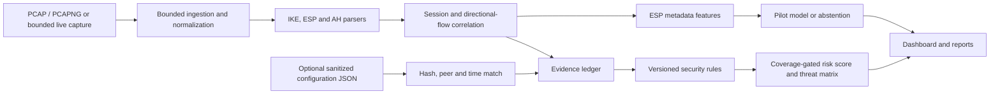

# AI-Powered IPsec VPN Protocol Analyzer and Security Assessment Framework

**Project report | SIH26160 | 30 September 2026**  
**Status:** Working local research prototype. This report describes implemented, checked behavior and the evidence still needed for broader claims.

## Abstract

IPsec can protect communication over untrusted networks, but capture interpretation requires separating visible IKE negotiation, outer ESP or AH metadata, configured policy, installed Security Association (SA) state, and traffic inferred from encrypted-flow patterns. This project implements a local analysis platform that ingests PCAP/PCAPNG or a bounded live capture, reconstructs visible IKE sessions and directional protected flows, applies nine narrow security rules, and produces an evidence ledger, threat matrix and reports. A pilot machine-learning model estimates *synthetic traffic profiles* from ESP-flow metadata and abstains outside its supported range. The dashboard provides separate pages for assessment, threats, sessions, flows, inference, evidence, packet references and exports. The prototype was tested against 44 reviewed strongSwan lab captures and a separate unprotected ICMP control; automated verification currently passes 121 tests. It does not decrypt ESP, certify an IPsec deployment, identify real applications inside ESP, or publish a numeric risk score without matched authorized configuration and sufficient assessed-rule coverage.

## 1. Problem and objectives

An analyst needs to answer several different questions: Is a capture related to IPsec? Which IKE version and selected IKE transforms are visible? Are ESP packets present in both directions? Which security concerns can be supported by packet or authorized configuration evidence? What can a model estimate about encrypted traffic, and when should it decline? The platform addresses those questions without requiring manual inspection of every packet.

The project objectives are to:

1. Build reproducible IPsec tunnel and transport lab cases with contrasting cryptographic and traffic configurations.
2. Ingest saved or bounded live traffic, parse visible IKE/ESP/AH metadata, and group messages into sessions and flows.
3. Evaluate a reviewed, limited set of security rules with explicit `PASS`, `FAIL`, `UNKNOWN` and `NOT_APPLICABLE` states.
4. Keep `OBSERVED`, `CONFIGURED`, `INFERRED` and unknown evidence distinct.
5. Offer a cautious risk score, threat matrix, pilot traffic inference, dashboard and exportable reports.

These objectives correspond to the supplied IPsec testbed, capture, AI identification, security assessment and reporting problem statement. “AI-powered” describes the bounded ESP traffic-profile estimator; protocol decoding and security rules remain deterministic.

## 2. System design

The analysis path is local. The upload API accepts a capture alone or a capture plus an optional sanitized configuration JSON. Each analysis has an ID used across dedicated dashboard pages. Reports are generated from the same analysis object so rule states and score status agree across views. The API is currently loopback oriented and synchronous; results are kept in memory rather than durable storage. [Implementation status](../design/IMPLEMENTATION_STATUS.md) and [Phase 6 check](../design/PHASE6_LOCAL_CHECK.md) give the detailed local verification record.

### 2.1 Capture ingestion and protocol parsing

The reader handles bounded PCAP and PCAPNG input and common Ethernet, raw IP and Linux cooked link types. Normalization recognizes IPv4/IPv6, native ESP, AH, IKE over UDP/500 and ESP encapsulated in UDP/4500. Malformed or truncated input produces diagnostics instead of a guessed protocol fact. IKEv2 parsing extracts visible proposals and selected transforms from a response; IKEv1 support is deliberately narrower. ESP/AH parsing exposes safe outer metadata such as SPI and sequence without exposing encrypted payloads. See [ingestion support](../design/INGESTION_SUPPORT.md) and [Phase 0–3 audit](../design/PHASE0_3_COMPLETION.md).

### 2.2 Correlation and evidence

The analyzer groups IKE messages by version and SPI, records paired exchanges and ambiguous or duplicate candidates, and groups ESP/AH traffic into directional flow episodes. Evidence entries carry field, state, source and packet references where applicable. A selected IKE proposal can be followed to its response packet. Missing or ambiguous input remains unknown. Identical concurrent SPI pairs and encrypted Child SA settings cannot always be resolved passively. See [correlation and evidence design](../design/CORRELATION_AND_EVIDENCE.md).

### 2.3 Authorized configuration input

The optional configuration input is a secret-free JSON snapshot with source ID, collection time, exact capture SHA-256, peer pair, and supported values: deployment type, mode, Child SA lifetime, replay window and PFS group. It is accepted as matched only if its hash and unordered peer pair identify one unambiguous IKE session and the collection time is within 24 hours of the final captured packet. A missing, stale, mismatched or partial snapshot cannot silently satisfy a rule. `CONFIGURED` describes declared intent, not proof that a Child SA installed or rekeyed. The exact schema and matching rules are in [configuration evidence v1](../design/CONFIGURATION_EVIDENCE_V1.md).

## 3. Security assessment

The current rules are intentionally narrow:

| Source | Checked condition | Evidence boundary |
| --- | --- | --- |
| Packet | IKEv1 legacy version | Visible IKE version only |
| Packet | Selected IKEv2 DES encryption | Selected IKE response, not ESP cipher |
| Packet | Selected IKEv2 MD5 PRF | Selected IKE response |
| Packet | Selected IKEv2 MD5 integrity | Selected IKE response; not applicable for AES-GCM authenticated encryption |
| Packet | Selected IKEv2 MODP group 1 | Selected IKE response |
| Configuration | Site-to-site tunnel-mode target | Matched declared deployment and mode |
| Configuration | Child SA lifetime at most 86,400 seconds | Matched declared lifetime |
| Configuration | Replay window at least 32 | Matched declared replay setting |
| Configuration | Nonzero Child SA rekey PFS group | Matched declared group |

For applicable rules, an unknown condition is not counted as a pass. Failed evaluations produce evidence-linked findings and affected-asset threat rows even when an aggregate score is withheld. The score policy `sih-risk-3` weights the nine controls and calculates a 0–100 *risk* number from failed versus assessed weight. Publication requires a matched configuration, at least one packet-observed rule, at least three assessed configuration controls, assessed replay and PFS controls, and at least 80% weighted applicable-rule coverage. Otherwise the score is `WITHHELD` and has no numeric value. The weights, bands and thresholds are project policy, not a standard certification. See [risk and configuration policy](../standards/RISK_AND_CONFIG_POLICY.md).

The present rules do **not** amount to a comprehensive audit of authentication strength, every cipher suite, key lifetime as installed, replay behavior at the receiver, metadata exposure or Child SA state. Those topics require more reviewed rules and authorized evidence.

## 4. Testbed and dataset

The isolated Linux strongSwan testbed generated tunnel, transport, AES-GCM and AES-CBC/HMAC scenarios, contrasting DH/PFS settings, IPv4 and IPv6 cases, and forced UDP/4500 encapsulation. Captures were taken at an outer interface. A subset includes live daemon checks of installed SAs; rekey cases have separate verification records. The shared dataset has **44 reviewed lab PCAPs** with secret-free JSON records and pinned SHA-256 hashes. Its index divides them into 14 reference, 18 train, 6 validation and 6 test runs. Complete runs, not individual packets, are the split unit. The dataset checker re-analyzes each capture and verifies record consistency. See the [dataset card](../../data/README.md), [dataset index](../../data/dataset-index.json) and [Phase 4 coverage matrix](../design/PHASE4_COVERAGE_MATRIX.md).

The six traffic labels are **generator profiles**: `voip-like`, `video-like`, `messaging-like`, `email-like`, `web-like` and ICMP. These are real packets from a controlled VPN lab, but the application traffic was generated for testing. The labels do not prove real WhatsApp, VoIP, email, browser or video application identification. A separate [six-packet unprotected ICMP trace](../../data/control/plain-icmp-01.pcap) is excluded from IPsec training and acts as a negative control.

Two modern and CBC cases were reproduced on a Kali Linux VM installation, with installed Child SAs and selected IKE/ESP evidence recorded. This is a different installation under the same operator and physical machine; another developer or physical host has not yet reproduced the dataset. An actual NAT traversal path and a reviewed AH capture are also absent. See [Phase 4 reproduction](../design/PHASE4_REPRODUCTION.md).

### 4.1 Reviewed capture results used for the demonstration

| Capture | Source record | Observed by current analyzer | What remains outside passive proof |
| --- | --- | --- | --- |
| [`modern-tunnel.pcap`](../../data/sample/modern-tunnel.pcap) | [Record](../../data/sample/modern-tunnel.json) | 10 packets, 1 IKEv2 session, 2 ESP directions; selected IKE AES-GCM-256; observed packet rules pass or are not applicable | Tunnel mode, installed ESP selection and PFS require configuration/SA evidence; score withheld on capture-only upload |
| [`cbc-no-pfs.pcap`](../../data/sample/cbc-no-pfs.pcap) | [Record](../../data/sample/cbc-no-pfs.json) | 8 packets, 1 IKEv2 session, 2 ESP directions; selected IKE AES-CBC-128 and integrity transform; observed packet rules pass | No-PFS is lab configuration provenance, not a passive PCAP verdict; score withheld on capture-only upload |
| [`plain-icmp-01.pcap`](../../data/control/plain-icmp-01.pcap) | [Record](../../data/control/plain-icmp-01.json) | 6 unprotected ICMP packets, 0 IKE sessions, 0 ESP flows | The lab label is not proof of unrelated host state outside the capture |

For an installed-state check from *separate rekey runs*, [modern verification](../../data/sample/modern-rekey-verification.json) records AES-GCM-256/ECP-384 on both peers after rekey, and [CBC verification](../../data/sample/cbc-rekey-verification.json) records AES-CBC-128/HMAC-SHA2-256 with no Child SA DH group. Those sidecars correspond to their own `modern-rekey` and `cbc-rekey` capture hashes, not to the three captures in the table above. They must be cited as daemon-state evidence, not packet-decoded facts.

## 5. AI component

The pilot classifier consumes directional ESP-flow metadata: packet and byte counts, captured-length statistics, interarrival timing and burst count. It fits standardized class centroids on the training runs; validation selects temperature and abstention thresholds. The data-only artifact records its schema and dataset hash. A flow must have an unambiguous ESP association, at least ten packets, adequate model support and confidence, or it becomes `unknown/other` with no confidence value. Inference is tagged `INFERRED` and never changes deterministic rule results or the risk score. See [Phase 5 evaluation](../design/PHASE5_EVALUATION.md) and [model artifact](../../models/artifacts/traffic-classifier/model.json).

| Split | Complete runs | Accepted / abstained | Accepted predictions matching generator label | All-run matching count |
| --- | ---: | ---: | ---: | ---: |
| Validation | 6 | 5 / 1 | 5 / 5 | 5 / 6 |
| Held-out test | 6 | 4 / 2 | 4 / 4 | 4 / 6 |

There is only one test run per class and only four accepted test predictions. Accepted-only calibration numbers therefore have very small denominators and do not establish reliable probabilities. The video-like and three-packet ICMP test runs abstained. A same-machine recount reproduced the saved results; fresh Kali runs give a cross-installation synthetic check, still under the same operator. Independent host/developer validation and privacy-reviewed real application traffic remain necessary before real-world traffic-identity claims.

## 6. Dashboard, API and reports

The frontend offers separate pages for **Assessment, Threat matrix, IKE sessions, Flows, Inference, Evidence, Packets and Reports**, plus a New capture page. Findings link to evidence entries and safe packet metadata. `UNKNOWN` and withheld explanations are visible. The reporting path produces full and redacted JSON and human-readable text, HTML and PDF outputs; shared copies omit sensitive identifiers such as the capture hash. Risk status and findings are derived from the same analysis data in each format. The local API accepts raw capture bytes or multipart capture plus sanitized configuration, with a 16 MiB capture limit and 16 KiB configuration limit. It keeps at most 16 analyses in memory, so links can expire after eviction or restart. It is currently a local analyst prototype, not an authenticated multi-user service. See [Phase 6 local check](../design/PHASE6_LOCAL_CHECK.md) and [local hardening](../design/P1_LOCAL_HARDENING.md).

## 7. Verification and security handling

`python -m pytest -q` passes **121 tests** as of this report. They exercise supported capture formats and link types, malformed/truncated input, protocol parsing, session/flow evidence, weak selected-transform rules, configuration matching, score gates, report consistency, model rebuilding and abstention, API lifecycle, and live-capture stop/error/byte limits. The 44-capture index consistency check passes. A bounded live WSL namespace run captured 86 packets with zero reported kernel drops; its selected IKE response and two ESP directions matched an offline capture from the same controlled run. This is one smoke check, not a representative throughput benchmark. See [implementation status](../design/IMPLEMENTATION_STATUS.md).

The API is restricted to loopback use and applies host/origin restrictions, bounded uploads, raw-upload cleanup, safe DOM insertion and response security headers. Generated secrets are not placed in published manifests. Packet-reference views expose selected metadata rather than raw frame contents. Private testbed configs and daemon logs still require review before any external sharing.

## 8. Limitations and next work

| Limitation | Consequence | Next evidence or engineering step |
| --- | --- | --- |
| Passive ESP hides payload and many Child SA settings | Mode, ESP cipher, replay and PFS cannot be fully established from outer packets | Add reviewed authorized installed-SA collection and bind it to a capture without conflating states |
| No matched configuration in capture-only uploads | Four configuration rules remain unknown and numeric score is withheld | Capture an authorized, sanitized and timely snapshot using [schema v1](../design/CONFIGURATION_EVIDENCE_V1.md) |
| Narrow security rules | Score is limited project policy, not comprehensive deployment security | Review and test broader authentication, key management, SA and metadata controls |
| Synthetic traffic-profile model | No validated real-application identification or dependable confidence | Collect consented real application runs; validate on a separate host and by another developer |
| Limited live measurement | No representative live-load or throughput claim | Repeat bounded live measurements across sizes, traffic mixes and failure cases |
| Local in-memory service | Analyses expire and multi-user hosting is unsupported | Decide hosting, authentication, authorization, retention and durable jobs |
| Missing optional/edge coverage | AH, real NAT traversal and some IKE variants are unverified | Add reviewed captures and parser tests as those use cases become required |
| Submission video pending | A finished video is not yet an artifact | Record and review the companion [video script](VIDEO_SCRIPT.md) against the actual UI |

## 9. Conclusion

The project has a functioning local IPsec analysis workflow: it parses reviewed captured traffic, correlates IKE and ESP activity, traces narrow security conclusions to evidence, provides a coverage-gated score where authorized configuration supports it, and exports analyst reports. Its AI component is a reproducible pilot for generated encrypted-traffic patterns with explicit abstention. The strongest defensible result is an evidence-aware prototype; the outstanding work is external validation, real-application evidence, broader installed-state assessment and deployment engineering.

## Project evidence index

- [Implementation phases](../design/IMPLEMENTATION_PHASES.md) and [current status](../design/IMPLEMENTATION_STATUS.md)
- [Project improvement plan](../design/PROJECT_IMPROVEMENT_PLAN.md)
- [Testbed coverage](../design/PHASE4_COVERAGE_MATRIX.md), [dataset card](../../data/README.md) and [reproduction record](../design/PHASE4_REPRODUCTION.md)
- [AI evaluation](../design/PHASE5_EVALUATION.md) and [saved evaluation JSON](../../models/artifacts/traffic-classifier/evaluation.json)
- [Configuration evidence contract](../design/CONFIGURATION_EVIDENCE_V1.md) and [score policy](../standards/RISK_AND_CONFIG_POLICY.md)
- [API/dashboard verification](../design/PHASE6_LOCAL_CHECK.md) and companion [video script](VIDEO_SCRIPT.md)
